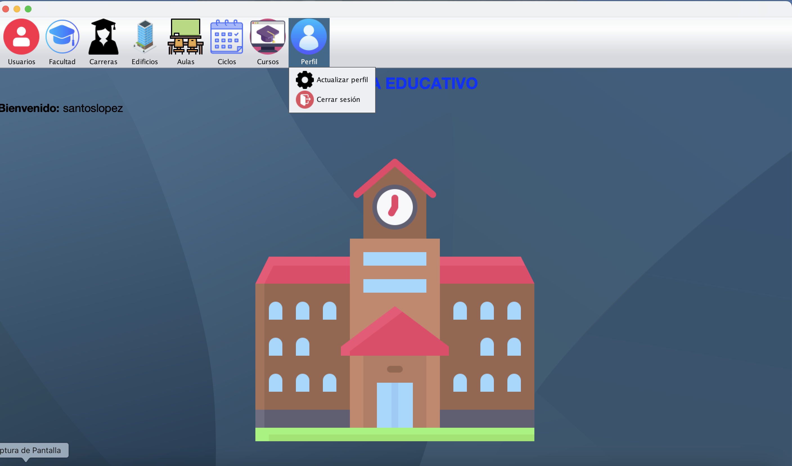

# Sistema Educativo
Software para la inscripción de estudiantes, asignación de cursos, horario de estudios,
etc. Cuenta con modalidad administrador que es el que hace el ingreso de los cursos, profesores, estudiantes, salones, etc.
Y modalidad estudiante que puede registrarse a su respectivo curso, etc. 

## Modalidad administrador
<code>Pantalla principal</code>

<code>Usuarios</code>

<code>Facultad</code>

<code>Carreras</code>

<code>Edificios</code>

<code>Aulas</code>

<code>Ciclos</code>

<code>Cursos</code>

<code>Perfil</code>

## Documentación
En progreso...
