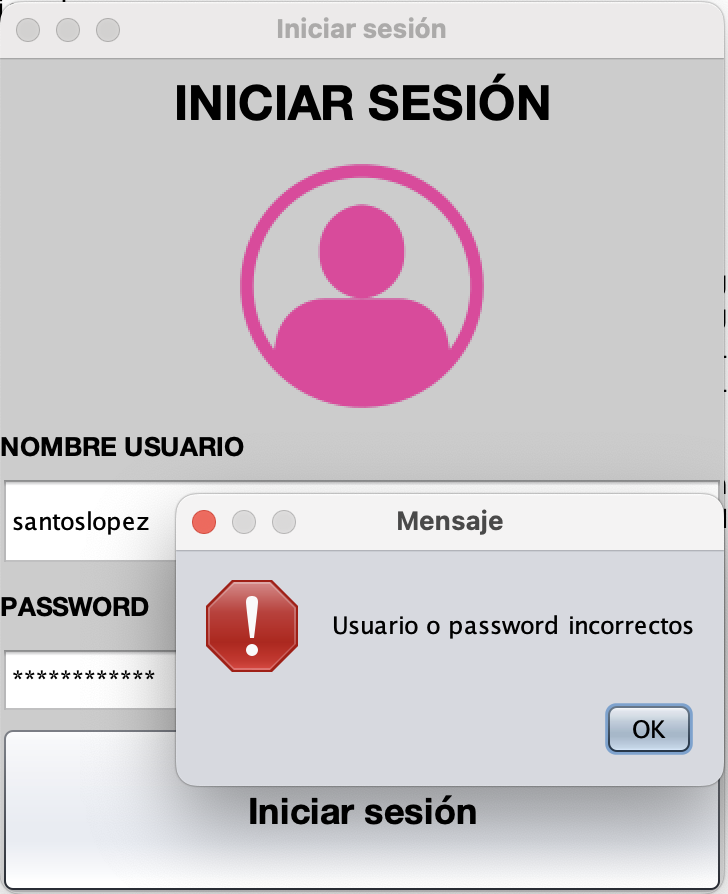
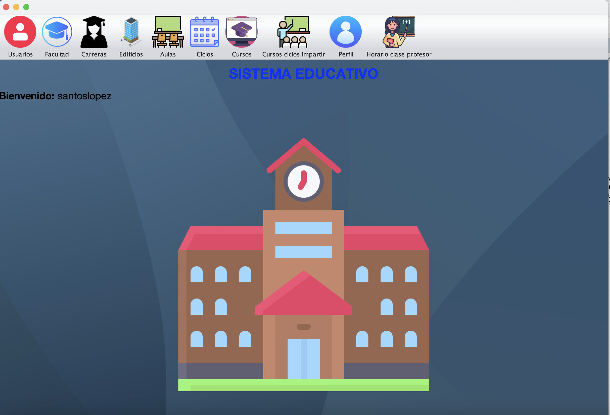
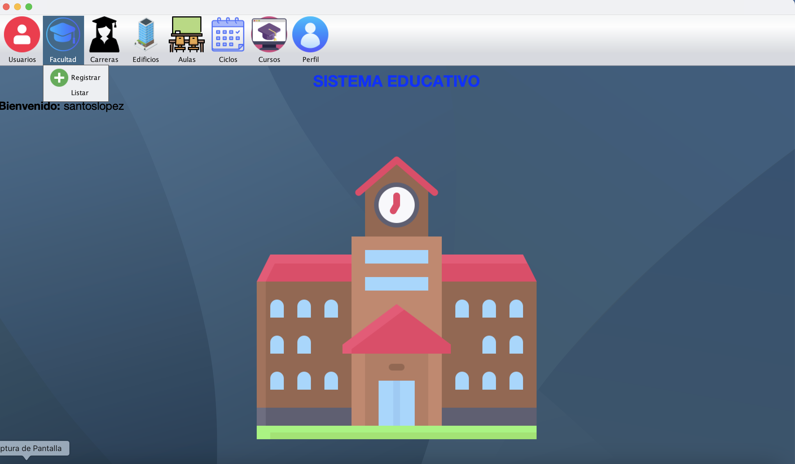
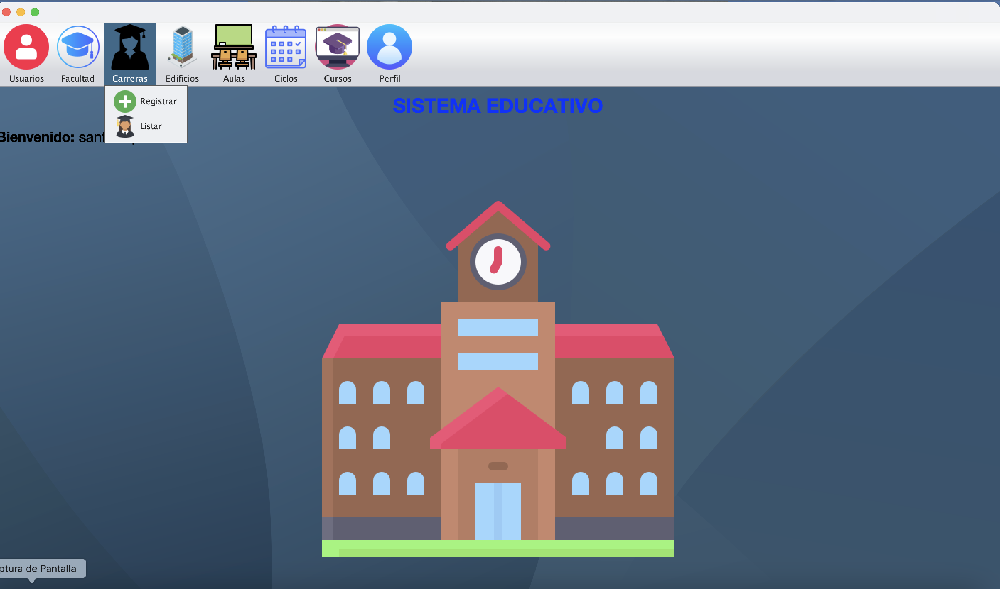
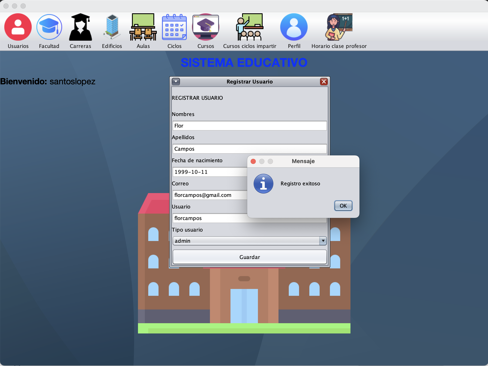
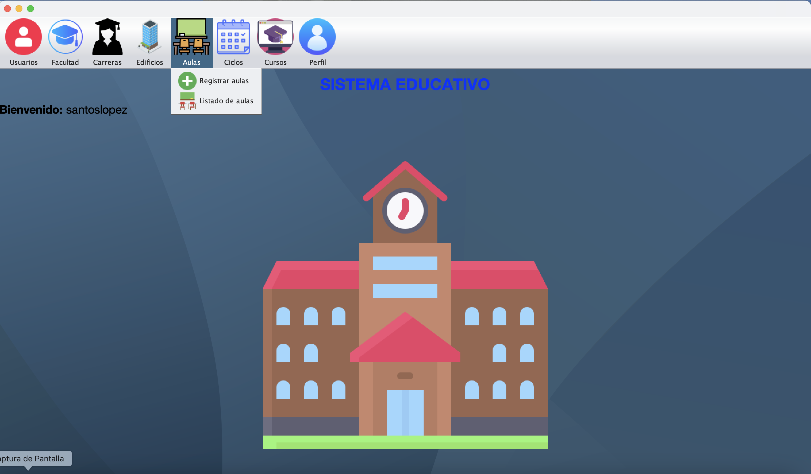
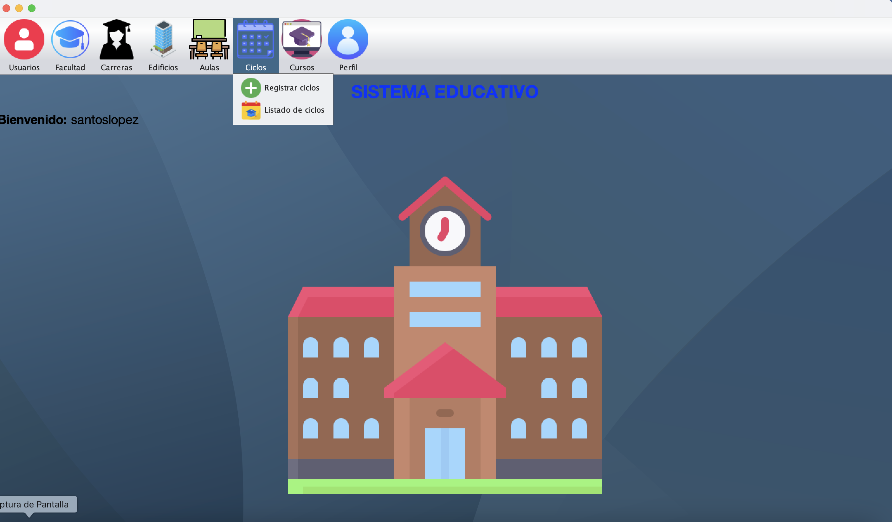
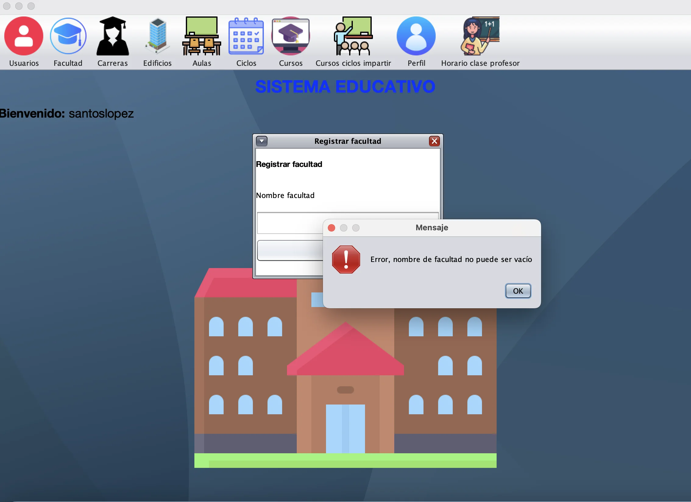

# 🧑‍💻 Santos López 

  
  <h3>Sistema gestión académica en Java Swing y MySQL</h3>
  <!--p>
    <strong>Ingeniero de Software y Desarrollador Web</strong> 
    Especializado en desarrollo web full stack, apasionado por soluciones digitales.
  </p-->

---

   | 
   |
  <!--a href="educacion.md"></a> |-->
  

---

# Sistema Educativo
Software para la inscripción de estudiantes, asignación de cursos, horario de estudios,
etc. Cuenta con modalidad administrador que es el que hace el ingreso de los cursos, profesores, estudiantes, salones, etc.
Y modalidad estudiante que puede registrarse a su respectivo curso, etc. 

## Inicio de sesión
Si el usuario o password son incorrectos el sistema indica el error.

### Modalidad administrador
La pantalla principal del sistema de la modalidad administrador es la que aparece en la siguiente imagen.
<code>Pantalla principal</code>

#### Usuarios
En la opción de usuarios se puede registrar, listar los usuarios registrados y modificar sus datos.

**Validar registro de usuarios**

**Registro exitoso de usuarios (profesores, estudiantes)**

**Listado de usuarios**

#### Facultad

Se realizan todas las validaciones adecuadas como **verificar que el nombre no exista** o que los datos no sean vacíos.

---

#### 📄 Documentación en progreso

  
© 2025 - Santos López | Todos los derechos reservados

Regresar a <a href="https://github.com/santoslopez">inicio</a>
